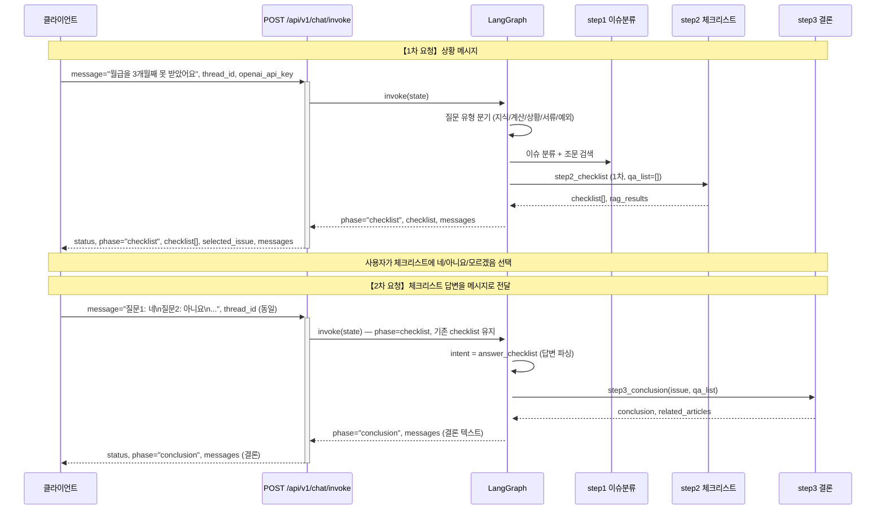
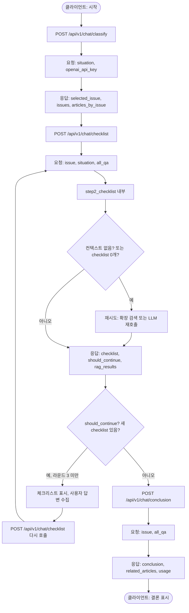
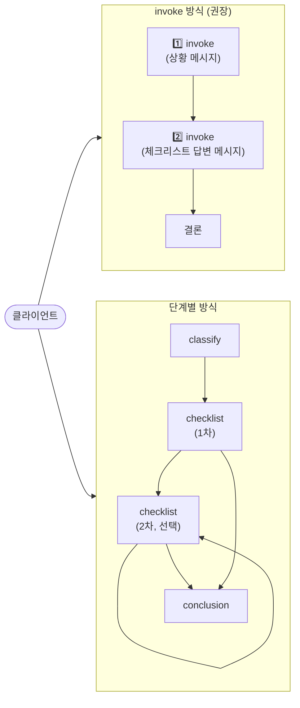
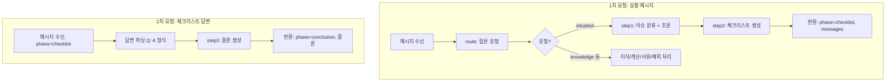

# LawChat API — 시작부터 결론까지 흐름도

API를 사용해 **상황 입력 → 이슈 분류 → 체크리스트 → 결론**까지 가는 흐름을 그림으로 정리했습니다.  
Mermaid를 지원하는 뷰어(VS Code 확장, GitHub, [Mermaid Live Editor](https://mermaid.live))에서 다이어그램이 렌더링됩니다.

---

## 1. 권장: invoke 한 엔드포인트 (2회 호출로 결론까지)

클라이언트가 **POST /api/v1/chat/invoke**만 사용할 때의 흐름입니다.  
**1차 요청**으로 체크리스트를 받고, **2차 요청**에 체크리스트 답변을 담아 보내면 결론을 받습니다.  
(현재 그래프는 체크리스트 1라운드만 지원 → 2차 요청 시 무조건 결론으로 직행)

---

## 2. 단계별 API (classify → checklist → conclusion)

**POST /api/v1/chat/classify** → **POST /api/v1/chat/checklist** (필요 시 반복) → **POST /api/v1/chat/conclusion** 순서로 호출하는 흐름입니다.  
체크리스트 **다음 라운드**는 `/checklist`의 `should_continue`로 판단합니다.

---

## 3. 전체 흐름 한눈에 (엔드포인트 기준)

---

## 4. 서버 내부 (invoke 시 그래프 노드 흐름)

invoke 한 번이 호출될 때, **그래프가 내부에서 어떻게 단계를 타는지** 요약입니다.

---

## 5. 참고

- **invoke**: 상태는 `thread_id` + 서버 메모리(또는 체크포인트)로 유지됩니다. 2차 요청 시 같은 `thread_id`와 이전에 받은 `checklist`/`phase`를 서버가 state로 사용합니다.
- **단계별 API**: 상태는 전부 **클라이언트**가 관리합니다. `classify` 결과와 `checklist` 호출 시마다 받은 `all_qa`를 누적해 `conclusion`에 넘깁니다.
- **체크리스트 0개·컨텍스트 없음 재시도**: 모두 **step2_checklist** 내부에서 이루어지며, `/checklist` 또는 invoke(그래프)를 통해 API로 호출될 때 자동으로 적용됩니다.

이 문서를 열어두고 위 Mermaid 블록을 지원하는 뷰어에서 보시면, API로 시작부터 결론까지의 흐름을 그림으로 확인하실 수 있습니다.
